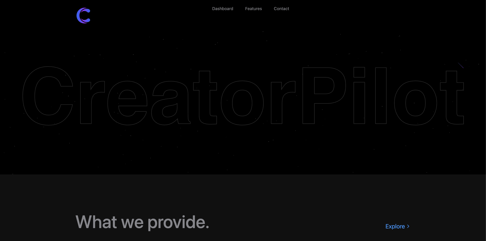
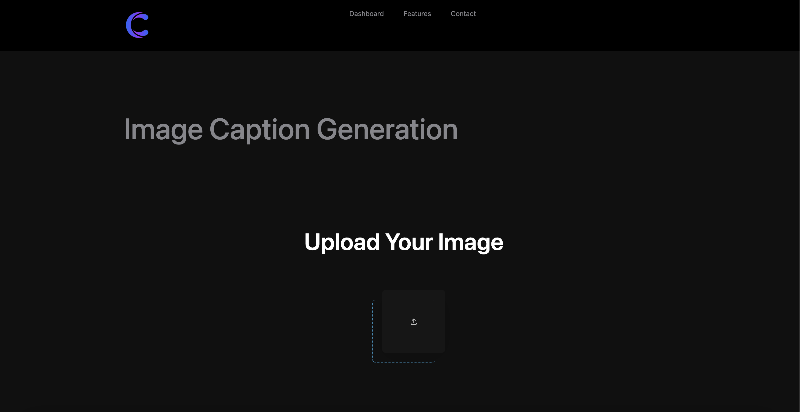

# 🎥🖼️ AI Captioning App (Image + Video)

An AI-powered web app that generates intelligent captions for both images and videos. Features real-time sentiment transformation, precise subtitle alignment, font customization, and multilingual subtitle support.

---

## 🚀 Features

- 📸 **Image Captioning**
  - Generate captions for uploaded images.
  - Modify tone: Humor, Sarcasm, Punify, Rephrase.

- 🎞️ **Video Captioning**
  - Upload videos and get subtitles embedded with precise word-level timing.
  - Customize:
    - 🎨 Font color
    - 🔠 Font size
    - 🌍 Subtitle language

- 🌐 **Multilingual Support**: Translate captions into your preferred language.
- 🤖 Powered by: OpenAI Whisper, Mistral 7B (via Ollama), and Transformers.

---

## 🧰 Tech Stack

### 🔙 Backend (Flask)
- Python 3.12+
- Flask
- Whisper (Faster-Whisper or OpenAI)
- Transformers
- MoviePy, OpenCV , pillow
- Flask-CORS

### 🔝 Frontend (React + Tailwind)
- React + TypeScript
- TailwindCSS
- Axios + GSAP animations
- Custom UI for file upload and subtitle controls


## 🛠️ Setup & Installation

### 📦 Install Requirements

```bash
# Backend
cd Backend
python -m venv env
source env/bin/activate  # or .\env\Scripts\activate on Windows
pip install -r requirements.txt

# Frontend
cd Frontend
npm install
```

### 🏁 Run App

```bash
# Start Flask backend
cd Backend
python app.py  # runs on http://localhost:5001

# Start React frontend
cd Frontend
npm run dev  # runs on http://localhost:5173
```

---

## 📤 Deployment

- Host frontend on **Vercel** or **Netlify**
- Use **Render**, **Railway**, or **Docker** for the backend
- Enable CORS for production domains in `app.py`

---

## 📸 Screenshots

Dasboard UI



Features 




---

## 🧠 Credits

- Whisper by OpenAI
- Mistral via Ollama
- React & Flask community
- Developed with 💻 by Ronit Mittal

---

## 📃 License

MIT License
